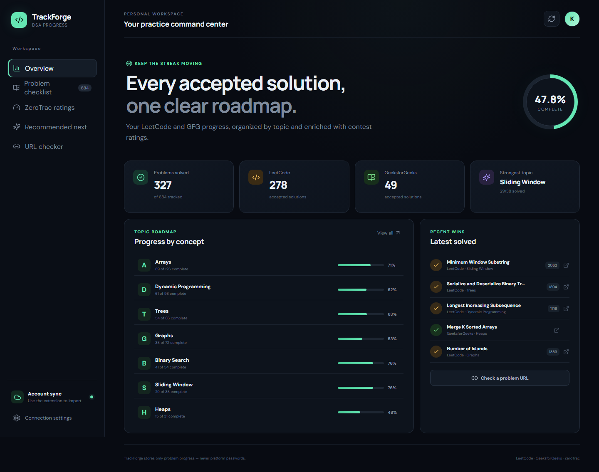
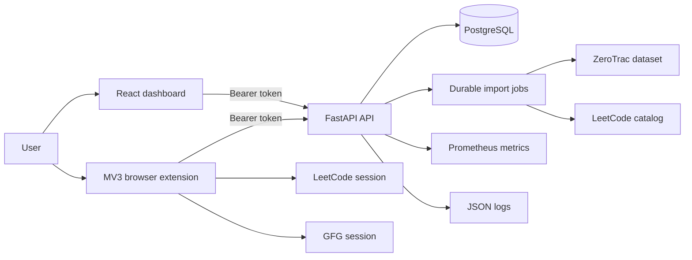

# TrackForge

TrackForge is a self-hosted DSA progress system that turns LeetCode, GeeksforGeeks, and ZeroTrac activity into one searchable roadmap. It combines a React dashboard, FastAPI service, PostgreSQL persistence, and a Manifest V3 browser extension.



## Why this project exists

Problem counts are easy to collect; useful progress context is harder. TrackForge normalizes problems across platforms, preserves automatic and manual solved state, groups equivalent questions, enriches problems with contest ratings and topics, and recommends the next problems from a user's own solved history.

## Engineering highlights

- Correct server-side filtering before pagination, with stable ordering and accurate totals.
- Durable, deduplicated import jobs that recover after an API restart.
- Alembic migrations and PostgreSQL for production; SQLite remains available for local use.
- Fail-closed production configuration, token verification, explicit CORS, security headers, and non-root containers.
- Retry/backoff for upstream 429 and 5xx responses without retrying permanent client errors.
- JSON request logs, request IDs, readiness checks, Prometheus metrics, and a bounded load-smoke tool.
- Browser-held platform credentials: TrackForge receives problem metadata and accepted state, never LeetCode or GFG passwords.
- CI gates for Python lint/tests/coverage, React unit coverage/build/E2E, extension tests, and PostgreSQL integration.

## System at a glance



See [Architecture](docs/ARCHITECTURE.md), [API](docs/API.md), [Operations](docs/OPERATIONS.md), [Deployment](docs/DEPLOYMENT.md), and [Engineering decisions](docs/ENGINEERING_DECISIONS.md).

## Quick start with Docker

Requirements: Docker Desktop or Docker Engine with Compose.

```powershell
Copy-Item .env.example .env
python -c "import secrets; print(secrets.token_urlsafe(32))"
```

Put the generated value in `.env` as `TRACKER_TOKEN`, then run:

```powershell
docker compose up --build
```

Open `http://localhost:5173`, enter `http://localhost:8000` plus the token in Settings, and verify the connection. API documentation is at `http://localhost:8000/docs`.

For the PostgreSQL topology used in production:

```powershell
# Also set a strong POSTGRES_PASSWORD in .env
docker compose -f docker-compose.yml -f docker-compose.production.yml up --build -d
```

Migrations run automatically before the API starts. Persistent data lives in named Docker volumes.

## Run from source

### Backend

```powershell
cd backend
py -3.12 -m venv .venv
.\.venv\Scripts\Activate.ps1
pip install -r requirements-dev.txt
Copy-Item .env.example .env
python -m scripts.migrate
uvicorn app.main:app --reload --port 8000
```

### Frontend

```powershell
cd frontend
npm ci
npm run dev
```

### Browser extension

Open `chrome://extensions` or `edge://extensions`, enable Developer mode, choose **Load unpacked**, and select `extension/`. Save the API URL and the same token used by the backend. TrackForge requests origin access only for the configured API host.

## Quality gates

```powershell
# Backend
cd backend
.\.venv\Scripts\python.exe -m ruff check app migrations scripts tests
.\.venv\Scripts\python.exe -m pytest --cov=app --cov-report=term-missing

# Frontend
cd ..\frontend
npm run test:coverage
npm run build
npm run test:e2e

# Extension
cd ..\extension
npm test
```

Current local verification: 23 backend tests passed (plus the opt-in PostgreSQL test in CI), 7 frontend tests passed, Chromium E2E passed, extension tests passed, and both production images run as non-root users.

## Operational evidence

A local Docker Desktop smoke run against the PostgreSQL production overlay sent 100 authenticated readiness requests at concurrency 10 with zero failures. Observed mean latency was 205.7 ms and p95 was 420.6 ms. This is a repeatable smoke result, not a public-cloud benchmark; use `backend/scripts/load_smoke.py` in the target environment before setting an SLO.

## Repository map

```text
backend/     FastAPI routers, domain layer, models, migrations, tests, scripts
frontend/    React + TypeScript dashboard, unit tests, Playwright E2E
extension/   Manifest V3 content scripts, popup, shared utilities, tests
docs/        Architecture, API, deployment, operations, decisions, screenshots
.github/     Automated quality gates and collaboration templates
```

## Current scope

TrackForge is designed as a secure single-user self-hosted application. The bearer token is an intentional low-complexity boundary, not a multi-tenant identity system. A public SaaS version would need per-user identity, authorization, tenancy isolation, quotas, and a managed job queue. Those trade-offs are documented rather than hidden.

## Contributing and security

See [CONTRIBUTING.md](CONTRIBUTING.md) for the development workflow and [SECURITY.md](SECURITY.md) for private vulnerability reporting. Notable changes are tracked in [CHANGELOG.md](CHANGELOG.md).

## License

MIT — see [LICENSE](LICENSE).