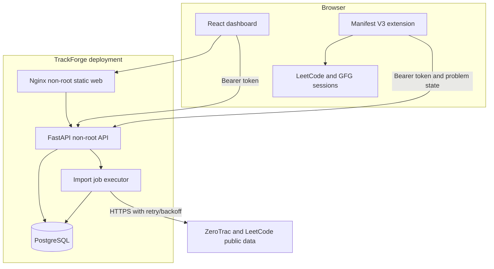
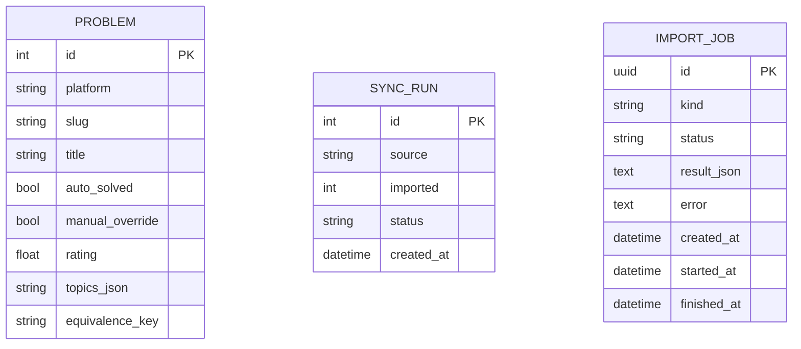

# Architecture

## Context

TrackForge is a single-user, self-hosted progress tracker. The browser extension observes activity inside the user's already-authenticated platform tabs; the API stores normalized problem metadata and progress. Platform credentials and cookies stay in the browser.

## Containers and trust boundaries

The bearer token crosses only the dashboard/extension-to-API boundary. `/api/health` and `/api/ready` are intentionally unauthenticated for orchestrator probes; application data and `/metrics` require authentication.

## Backend modules

- `app/config.py`: environment parsing and fail-closed production validation.
- `app/database.py`: SQLAlchemy engine/session lifecycle and UTC helpers.
- `app/models.py`: persisted problems, sync runs, and import jobs.
- `app/domain.py`: normalization, serialization, and solved-state grouping.
- `app/security.py`: bearer-token verification.
- `app/http_client.py`: bounded upstream retries and exponential backoff.
- `app/observability.py`: JSON logging and Prometheus instruments.
- `app/routers/`: system, problems, sync, recommendations, and durable jobs.
- `migrations/`: reviewed Alembic schema history.

`app/main.py` is the composition root: it configures logging, middleware, lifespan recovery, and routers. Business behavior lives outside the entrypoint.

## Core data model

A problem's effective solved state is `manual_override` when present, otherwise `auto_solved`. Equivalent LeetCode/GFG problems share progress through `equivalence_key` without destroying their platform-specific records.

## Important request flows

### Problem query

1. The client sends optional platform, solved, topic, search, and rating filters.
2. The API builds SQL predicates before count, offset, and limit.
3. The database returns a stable page plus an accurate filtered total.
4. Equivalent problems receive their group solved state during serialization.

### Durable import

1. The client queues an import and receives `202 Accepted` plus a job ID.
2. The API deduplicates an existing queued/running job of the same kind.
3. The executor marks the persisted job running, fetches upstream data with bounded retry/backoff, commits domain changes, then records success or failure.
4. The client polls the job endpoint. On API restart, lifespan recovery requeues incomplete persisted jobs.

This executor fits a single-instance personal deployment. Horizontal scale should replace the in-process executor with a lease-based external queue; see [Engineering decisions](ENGINEERING_DECISIONS.md).

## Frontend boundaries

`App.tsx` coordinates shared state and navigation. Views are separated into dashboard, explorer, recommendations, and URL checker modules; reusable problem and settings UI lives under `components/`. API access and persistent job polling are isolated in `api.ts`.

## Failure model

- Invalid production configuration fails during startup.
- Database unavailability fails readiness while liveness stays available.
- Invalid tokens return 401 without data disclosure.
- Rate limits and transient upstream failures retry within a fixed budget.
- Permanent upstream 4xx errors fail immediately.
- Import errors are persisted and visible to polling clients.
- Every API response carries an `X-Request-ID`; logs include the same correlation key.